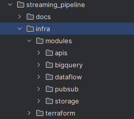

# Project Deliverables

This document outlines the deliverables for the Streaming Pipeline project, addressing the requirements specified in the [Challenge Context](./doc01_challenge_context.md).

---

## 1. Overview

To solve the problem, I decided to create the entire environment using Infrastructure as Code (IaC) with Terraform.
Despite the initial effort, I believe this approach aligns with best practices, ensuring consistency, scalability, and automation in the deployment process.
By leveraging IaC, I aimed to minimize manual configurations and provide a more reliable and maintainable infrastructure.

The IaC structure is as follows:

As the project required storing data in GCS as JSON files, acting as a landing layer, I decided to add an additional step in the Dataflow process.
This step not only writes the raw event data to GCS but also simultaneously ingests it into a BigQuery table, effectively creating a raw layer within the data warehouse.

This approach allows for the use of BigQuery queries to transform data from the raw layer into curated views or tables, providing flexibility for future data modeling and enabling quicker access to analytics and business insights.

---

## 2. Data Modeling and Architecture

### Data Model
- Data Model Diagram: The data model is designed to support efficient querying and analytics.
  

- DDL Statements: The DDL scripts for creating the BigQuery tables are located in the following path: [infra/modules/bigquery/main.tf](../infra/modules/bigquery/main.tf)

- Partitioning and Clustering Strategies:

  I decided to partition the tables by their main date columns: `order.order_date`, `inventory.timestamp`, and `user_activity.timestamp`.
  Partitioning by date helps improve query performance by allowing BigQuery to scan only the relevant partitions when filtering by date ranges, which is particularly useful for time-series data and large datasets.

  Regarding clustering, I chose the following strategies:
  - Order Table: Clustered by `status` and `customer_id`
  - Inventory Table: Clustered by `product_id` and `warehouse_id`
  - User Activity Table: Clustered by `activity_type` and `user_id`

  Clustering organizes the data based on the values of specific columns, which enhances query efficiency when filtering, aggregating, or performing lookups on these columns.
  It reduces the amount of data BigQuery needs to process, optimizing both performance and cost.

### Future Recommendation:

  As an evolution of this architecture, I recommend implementing a raw and curated data layer approach.
  The raw layer would store the data exactly as received from the event sources, ensuring full data fidelity and traceability.
  The curated layer would apply business-specific modeling, providing a structured and optimized view of the data tailored to business needs.
  This separation of layers allows for greater flexibility in adapting the data model as business requirements evolve.

  Additionally, if cost is a critical factor, an alternative approach could be to store the raw data in Iceberg or Delta tables with ACID properties.
  This method offers a more cost-effective storage solution compared to BigQuery while maintaining data reliability.
  External tables can then be created to allow BigQuery to read this data seamlessly, combining cost savings with analytical capabilities.

---

## 3. Streaming Pipeline Implementation

The Dataflow pipeline created for this project is implemented a Custom Template with the script `dataflow_pubsub_to_gcs.py`.

This pipeline is responsible for processing events received from Pub/Sub, transforming the data, storing it as JSON files in GCS, and simultaneously ingesting it into a BigQuery table to establish a raw layer.

follow script [dataflow_pubsub_to_gcs.py](../infra/modules/dataflow/dataflow_pubsub_to_gcs.py)

### Pipeline Steps:
1. Read from Pub/Sub:
   The pipeline listens to messages from the `backend-events-topic-sub` subscription, handling all incoming event types (`order`, `inventory`, and `user_activity`).

2. Data Transformation:
   Using the `TransformData` class, the pipeline enriches the data with GCS paths and formats the messages into a structured dictionary with the `table`, `data`, and `gcs_path` fields.

3. Write to GCS:
   The `WriteToGCSDoFn` function is responsible for writing the transformed data as JSON files to Google Cloud Storage, following the organized folder structure specified in the Challenge Context.

4. Write to BigQuery:
   In parallel to the GCS output, the pipeline filters messages by event type and writes them directly to the corresponding BigQuery tables (`order`, `inventory`, `user_activity`).

This dual approach of storing raw data both in GCS (as landing) and in BigQuery (as raw layer) offers the flexibility to generate curated layers using BigQuery queries.

Additionally, the use of Apache Beam provides a robust and scalable foundation to handle high-throughput streaming data efficiently.

Due to time constraints, the script uses a workaround with a branching logic for the three event types (order, inventory, and user_activity) to dynamically select the BigQuery table based on the event received.

Ideally, the Apache Beam WriteToBigQuery would be customized to handle this dynamically without the need for branching. This improvement is noted in the backlog for future development to streamline the pipeline and enhance maintainability.

---

## Results

The required GCS path structure was fully implemented as specified in the Challenge Context, ensuring that the JSON files are stored following the expected hierarchical format.

This approach not only meets the project requirements but also facilitates organized data storage and easy retrieval.

The following image demonstrates the GCS folder structure created by the Dataflow pipeline:

All resources described in this repository were fully implemented, tested, and are fully operational.

The end-to-end data flow is functioning correctly, enabling real-time data ingestion from Pub/Sub, processing through the Dataflow pipeline, and storing data in GCS and BigQuery for real-time consumption.

This robust setup ensures that data is seamlessly captured, transformed, and made available for analytical and business intelligence purposes, showcasing the project's capability to handle real-time streaming data efficiently.

---

## Contact
📧 thalesgibbon@example.com